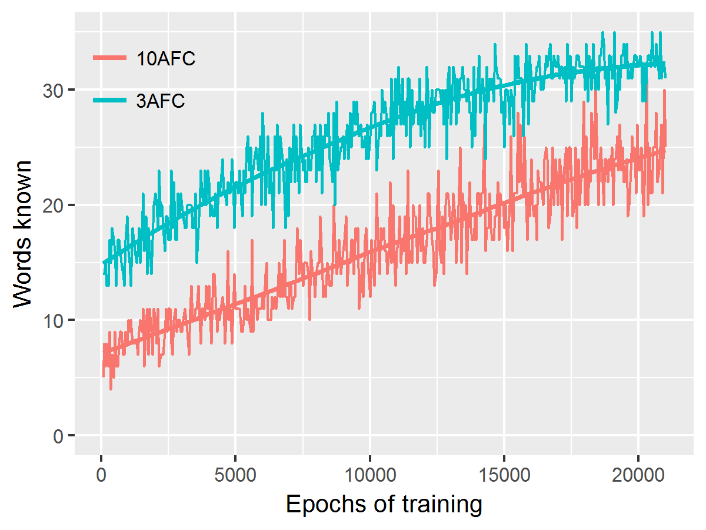

# McMurrayHorstSamuelson2012

This package is an R-implementation of the associative-learning model in 
[McMurray, Horst and Samuelson (2012)](https://www.ncbi.nlm.nih.gov/pmc/articles/PMC3632668/).

***

The following figure was created during a test of the network on the article's
Simulation 1.1 ("Learning Measured By Comprehension"). See `inst/demo.R`. I
didn't run the network for all 100,000 iterations, just 20,000, but it looks
enough like the article's Figure 4.

